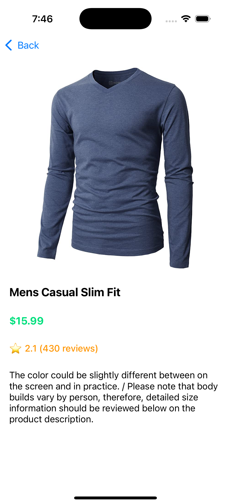

# 🛍️ ProductsList App

A sleek iOS application that displays a list of products fetched from [FakeStoreAPI](https://fakestoreapi.com).  
Users can toggle between **List View** and **Grid View**, browse details of products, and enjoy a clean user experience powered by modern iOS technologies.

---

## ✨ Features

- Display a list of products from a remote API
- Toggle seamlessly between List View and Grid View
- Navigate to a Product Details screen showing product image, name, price, rating, and description
- Supports pagination to load more products smoothly as the user scrolls
- Handles network failures gracefully and loads cached data if available

---
|  |  |  |
| --- | --- | --- |
|  |

---

## 🛠️ Technologies Used

**UIKit**  
Builds the user interface, manages layouts, and handles custom animations.

**Combine**  
Binds data between ViewModel and View, managing asynchronous updates reactively.

**SDWebImage**  
Downloads and caches product images efficiently with placeholder support.

**CoreData**  
Stores and retrieves cached products locally for offline access.

**Alamofire**  
Simplifies API requests, response handling, and error management.

---

## 🧩 Architecture

The project follows a **Clean Code** architecture using **MVVM (Model-View-ViewModel)** combined with the **Router** pattern for navigation. This architecture separates concerns clearly and makes the codebase scalable and testable.

- **Model-View-ViewModel (MVVM)** handles UI state management and business logic separation.
- **Router pattern** cleanly manages navigation, decoupling routing logic from view controllers.
- **Clean Architecture** separates UI, domain, and data layers with clear responsibilities and inward dependencies for maintainability and testability.

Dependency Injection is handled using the **Factory** library to ensure loose coupling between components and promote reusability and testability.

---

## 🌐 API

This app fetches products data from:

[https://fakestoreapi.com](https://fakestoreapi.com)

---

## 🧪 Unit Tests

The project contains a comprehensive set of unit tests covering:

- The **GetProductsUseCase** — to ensure correct behavior when fetching from both API and cached data

These tests ensure robustness, reliability, and maintainability of core app functionality.

---

## 🚀 Getting Started

1. Clone the repository:
```bash
git clone https://github.com/yourusername/ProductsList.git
```
2. Navigate to the project directory
```bash 
cd ProductsList
```

3.	Open the project in Xcode
```bash 
open ProductsList.xcodeproj
```
4.	Install dependencies
   - This project uses Swift Package Manager — Xcode will automatically resolve dependencies on project open.
    If needed, go to Xcode > File > Packages > Resolve Package Versions.

5.	Run the app
   - Select an iOS Simulator (or a real device), then press Cmd + R or click the Run button.

6.	Running Unit Tests
   - To run all unit tests, select Product > Test in Xcode, or press Cmd + U.

---

## Requirements

•	Xcode 15 or later
•	iOS 15.0 or later
•	Swift 5.9 or later
